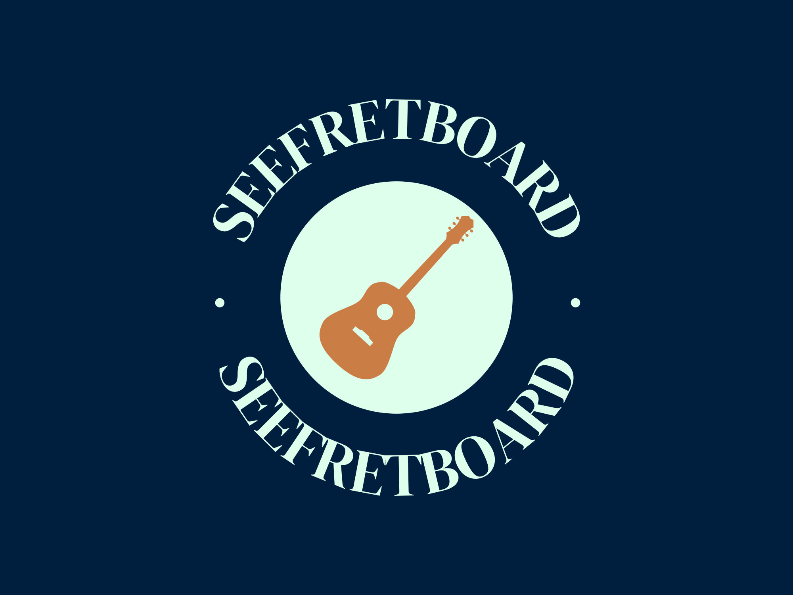

.. seeFretboard documentation master file, created by
   sphinx-quickstart on Mon May 29 22:08:07 2023.
   You can adapt this file completely to your liking, but it should at least
   contain the root `toctree` directive.

Welcome to seeFretboard's documentation!
========================================

**Unlocking Boundless Possibilities for Music Education, Research, and Creative Exploration**

Contents
==================
.. toctree::
   :maxdepth: 3

   setupInstallation

   dependencies

   configuration

   modules

   credits

   contributing

   history

Indices and tables
==================
* :ref:`modindex`
* :ref:`search`
